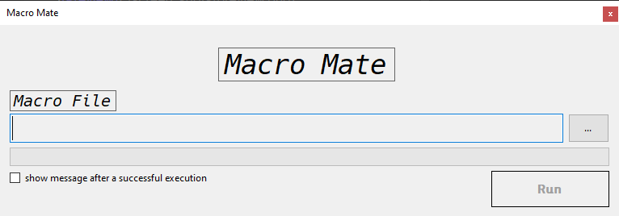
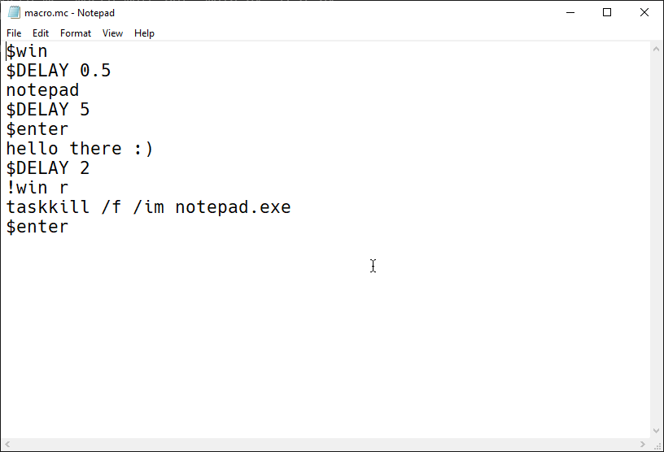

# Macro Mate (GUI)
A simple macro program with macro scripting, gui version of the previous macro mate

##### Preview

##### Macro Script

> ### Requirements
>* Python
>   * pyautogui
>   * keyboard
>   * pynput

#### How to use macro script
1. If you wanna simulate a **shortcut key** press then write "!" 
then your key name, for example: 
> !win r
2. If you wanna press a **special key** like `ctrl`, `alt`, `tab`, `enter` etc. then write "$" then the **special key's** name, for example:
>$tab
3. If you just want to press **normal keys** like alphabetical keys, number keys then you have to write just the letter or number, **Note: a single space will also be considered as a key**, for example:
>Hello World
>1234
>
5. If you wanna pause the script, then use the `$DELAY` keyword followed by the time in seconds, for example:
>\$DELAY 1
>
>\$DELAY 0.1

### Here's a simple script to open notepad and type something
>1. !win r
>2. notepad
>3. \$enter
>4. Hello There :)
>5. \$enter
>6. \$DELAY 2
>7. !win r
>8. taskkill /f /im notepad.exe
>9. $enter
